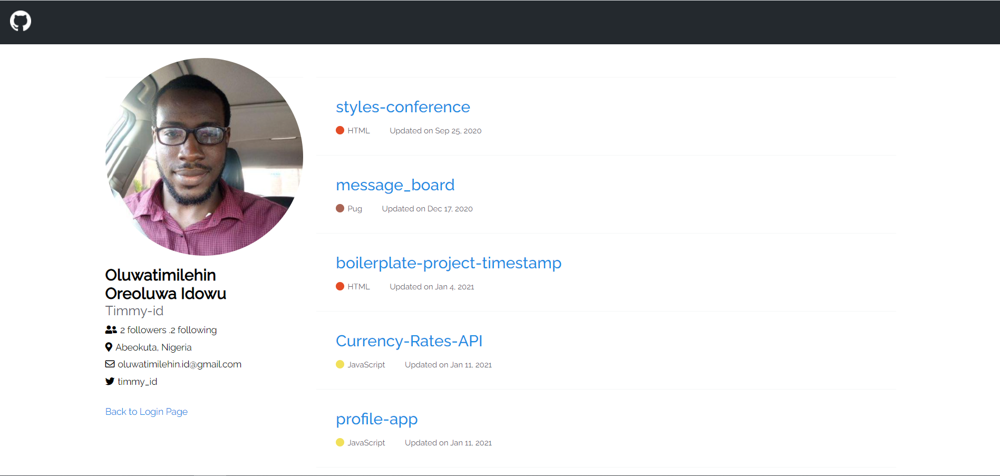

# Buycoins-frontend-challenge

## About The Project

This project allows you to quickly view a user's GitHub repository without logging in to GitHub.

### Built With

This project was built using:
* [GraphQL GitHub API](https://developer.github.com/v4/explorer)
* [HTML]
* [CSS]
* [Javascript]

## Usage

* To use this, go to [https://timmy-id.github.io/Buycoins-frontend-challenge](https://timmy-id.github.io/Buycoins-frontend-challenge)

* Enter the GitHub username which then loads your repository

## Contact

Oluwatimilehin Idowu - [@timmy_id](https://twitter.com/timmy_id) - oluwatimilehin.id@gmail.com
Live Link: [https://timmy-id.github.io/Buycoins-frontend-challenge](https://timmy-id.github.io/Buycoins-frontend-challenge)
Project Link: [https://github.com/Timmy-id/Buycoins-frontend-challenge](https://github.com/Timmy-id/Buycoins-frontend-challenge)
